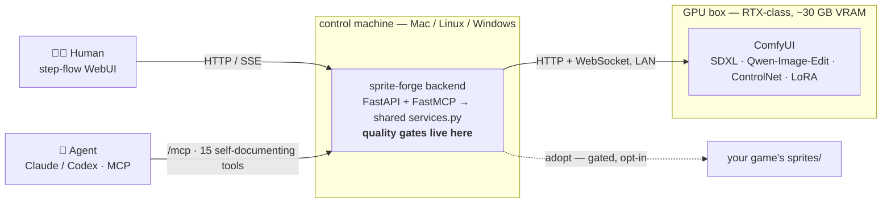

<p align="center">
  
</p>

# sprite-forge-mcp

[](LICENSE)
[](requirements.txt)
[](https://modelcontextprotocol.io)
[](https://github.com/comfyanonymous/ComfyUI)

**English** · [日本語](README.ja.md)

> **Type an idea → get a transparent, game-ready character sprite. Same engine, drivable by you (WebUI) or your AI agent (MCP).**

<p align="center">
  
</p>
<p align="center"><sub><b>One character bible</b>, generated from a single base sprite — a consistent turnaround + expressions + actions + alt costumes. And every sprite comes out as clean, transparent RGBA:</sub></p>
<p align="center">
  
</p>

`sprite-forge` is a local [ComfyUI](https://github.com/comfyanonymous/ComfyUI) studio that turns a text idea into a transparent **RGBA sprite**, a full **character bible**, a **character LoRA**, and then that character **in any pose** — with hard-won production rules baked into quality gates, so broken assets get caught before they reach your game.

One Python backend, **two faces**: a step-flow **WebUI** for humans and a **FastMCP server** for agents (Claude / Codex / any MCP client) — both calling the *same* `backend/services.py`, so the gates can't be bypassed from either side. Heavy generation runs on a remote ComfyUI GPU box; the backend is a thin orchestrator that does the deterministic, gate-keeping work.

> *MCP = [Model Context Protocol](https://modelcontextprotocol.io) — the open standard that lets agents like Claude Code plug capabilities into an AI.*

**Status:** runs end-to-end on a real RTX 5090 + Mac setup — the matte, character-bible, and character-LoRA pipelines are all working. MIT. Needs a CUDA GPU running ComfyUI (see [Requirements](#requirements)).

## Why

Making character sprites for a small game with image models is a special kind of pain, and I hit all of it shipping assets for my own RPG:

- **Chroma-key black leaks** — the "closed black" trapped between an arm and a ribbon survives a naive flood-fill; one accepted sprite had **200k+ leaked pixels**.
- **Damage-version drift** — the `-damaged` version comes back re-posed and a few pixels off, so it no longer lines up with the base in-game and the CSS layout breaks. *"Don't move the original by a single dot."*
- **Style drift** — drop the retro-pixel phrase and the model slides into glossy anime.
- **Manual touch-ups never work** — repainting cloth/skin/outline by hand had a success rate of zero.
- **The version explosion** — "which one looks right" is subjective, so one sprite ground out to **v39**.

So sprite-forge doesn't just call a model — it **turns each of those scars into a gate**. Outputs are forced to RGBA with transparent corners; damaged variants are machine-checked to match the base bbox within **≤1 px**; the mandatory style phrase is auto-injected; there is **no hand-paint tool** (you point with masks/dots, the model regenerates); and nothing reaches your game folder without passing the adopt gate. A broken asset can't silently reach your game — it fails a gate instead.

## Why not just use ComfyUI directly?

You already have ComfyUI — that's the engine here. sprite-forge adds the parts ComfyUI doesn't:

- **Two faces, one logic** — a guided WebUI *and* an MCP server for agents, sharing one gated backend. Your AI agent can run the whole pipeline end to end; you don't hand-wire node graphs.
- **A character pipeline, not one-off images** — idea → sprite → a *consistent* bible → LoRA → that character in any pose, as a single flow.
- **Production gates** — transparent-corner RGBA, ≤1 px damage-version alignment, mandatory style, audited adopt. Raw ComfyUI will happily hand you a broken sprite; this won't.
- **Reproducible, no hand-paint** — you point with masks/dots and regenerate; no manual pixel rescue.

## Architecture



The backend can run on the same machine as ComfyUI or a different one (it just needs `SPRITEFORGE_COMFY_URL`). It does **no local inference** — that is by design.

## The pipeline

```
pictures you like ─▶ ① character LoRA ─▶ ② character bible (23 panels) ─▶ ③ review & redraw any panel by words
                                        └▶ ④ new pictures of that character   └▶ ⑤ sprites in any pose (+ pose control)
```

The look is never described in words inside the product. A LoRA trained on the pictures you bring
carries both the character and the rendering style; every generation is Anima + that LoRA with
content tags only (view, expression, outfit, chibi, item).

1. **Character bible** — `generate_character_bible(images, name, char_desc, attr?, lora_name?, trigger?, captions?, steps?)`.
   Trains an Anima LoRA on `images` (comma-separated paths / URLs / data URLs; `captions` '|'-separated
   per picture, so different outfits are learned apart) unless `lora_name` names an existing one, then
   draws 23 panels: turnaround, leotard body reference, six expressions, three actions, three costumes,
   chibi, wardrobe items. Output: an aligned PNG sheet, a self-contained HTML bible, the panels.
2. **Review and adjust** — `list_bible_panels` · `redraw_panel(name, panel, tags?, seed?, avoid?)`:
   redraw any one panel from your words (and words to avoid), keep the old one under `history/`, rebuild the sheet.
3. **New pictures of the character** — `generate_from_bible(name, prompt, width?, height?, seed?)`.
4. **Sprites** — `generate_sprite(prompt, lora_name?, pose_image?)`: Anima txt2img (+LoRA, +Anima-Control-Pose) → ToonOut → RGBA candidates with measurements.
5. **LoRA on its own** — `train_character_lora(bible_name | images, trigger?, steps?, captions?)` · `refine_image(image, prompt, lora_name, denoise?)` (img2img redraw of any picture with a LoRA).

Edits that need a reference picture rather than a LoRA use JoyAI-Image-Edit-Plus: `make_mask` (SAM 3.1) →
`generate_variant` (base pixels restored outside the mask), and `generate_image(prompt, style_preset | style_refs)`
with style presets (`save_style_preset` · `list_style_presets` · `delete_style_preset` — bundles of pictures).
`make_transparent` (ToonOut) and `pixelize` (Pillow) finish sprites. Pictures come in as a cache path, an
`http(s)` URL, a `data:` URL, or the WebUI upload (`POST /api/upload`).

## Requirements

This is a **remote-GPU orchestrator — it does not generate anything by itself.** You need:

- A **CUDA GPU running ComfyUI 0.34+** reachable over HTTP (RTX 5090 class; the JoyAI int8 edit model and Anima co-load).
- The **model set**: Anima Base/Turbo (+ `qwen_3_06b_base`, `qwen_image_vae`), Anima-Control-Pose, JoyAI-Image-Edit-Plus (+ `qwen3vl_8b_joyimage_edit_plus`, `wan_2.1_vae`), ToonOut via ComfyUI-RMBG, SAM 3.1 (native).
- **Python 3.13** and `uv` for the backend; `sd-scripts` (Anima) on the GPU box for LoRA training.

## Quickstart

```bash
git clone https://github.com/kitepon/sprite-forge-mcp.git && cd sprite-forge-mcp
uv sync
cp .env.example .env            # SPRITEFORGE_COMFY_URL → your ComfyUI, SPRITEFORGE_BOX_SSH → the GPU box
.venv/bin/uvicorn backend.app:app --host 0.0.0.0 --port 8765
```

Or on the server: `docker compose up -d --build` (port 8766 → 8765, `.cache` as a volume).

- **WebUI** → `http://<host>:8765/`  ·  **health** → `curl <host>:8765/api/gpu`
- **MCP endpoint** → `http://<host>:8765/mcp/` (streamable HTTP; register it in your agent CLI)

## MCP tools (the agent face)

MCP and REST call the same `Services` functions; defaults live only in those signatures.

| Group | Tools |
|---|---|
| Status | `gpu_status` · `list_loras` · `list_jobs` · `job_status` |
| Sprites | `generate_base` · `generate_sprite` · `make_transparent` · `pixelize` |
| Character | `generate_character_bible` · `bible_status` · `list_bible_panels` · `redraw_panel` · `generate_from_bible` |
| LoRA | `train_character_lora` · `train_status` · `refine_image` |
| Style pictures | `save_style_preset` · `list_style_presets` · `delete_style_preset` · `generate_image` |
| Variants | `make_mask` · `generate_variant` |

## Design principles (the "scars")

- **Measure, don't gate.** Corner alpha, bbox, canvas and bbox deltas are reported as numbers; nothing is rejected for you.
- **The look lives in pictures, not in prompts.** No style phrase is baked into the product; presets are bundles of pictures.
- **Wait for the GPU, don't time it out.** A job waits as long as ComfyUI holds the prompt; it fails only when the prompt is gone.
- **No hand-paint.** You point (mask / point / line); the model regenerates. Fixes are re-generation, never manual rescue.
- **No silent fallback.** Failures surface with the stage and reason; nothing is quietly "fixed."
- **Adopt is explicit and irreversible** — it writes into your game project only when you ask.

## Documentation

- **[INSTALL.md](INSTALL.md)** — setup, optional features, honest limitations
- **[docs/00_overview.md](docs/00_overview.md)** — canonical documentation map
- **[docs/models.md](docs/models.md)** — model sources, placement, required ComfyUI nodes
- **[CLAUDE.md](CLAUDE.md)** — implementation reference (the source of truth)
- **[docs/](docs/)** — design docs (context, research, architecture, output contract, …)

## License

[MIT](LICENSE). Model weights are **not** included — download them yourself (see [docs/models.md](docs/models.md)); each model carries its own license.
